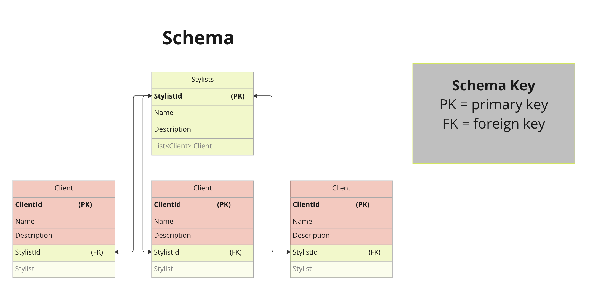

# Claire's Hair Salon Directory.

#### By _Seth Gonzales_

#### _An application to manage a list of hair stylists and their clients for Claire's Hair Salon._

## Technologies Used

* HTML
* CSS
* C#
* .NET 6
* ASP.NET Core MVC 6
* MySQL
* MySQLWorkbench
* Entity Framework Core

## Description

This application organizes and builds a repository of hair stylists and their clients, storing this information using a database. Employees may add new stylists and clients, select to see more specific details, and edit or delete entries. This project follows object oriented design and object relational mapping, with the stylist and client objects. This is an ASP.NET Core MVC application.
<p align="center">
  
</p>

## Setup and Installation Requirements

### Setting up the project
* Before starting, check that all required technologies are used. For more information on configuring [MySQL](https://dev.mysql.com/doc/mysql-installation-excerpt/5.7/en/) and [MySQLWorkbench](https://dev.mysql.com/doc/workbench/en/), follow the links provided.

* Navigate to the repository for Claire's Hair Salon [GitHub](https://github.com/sethgonzales/HairSalon.Solution).
* Clone the repository down using `$git clone https://github.com/sethgonzales/HairSalon.Solution.git` in your terminal.
* Within the production directory `HairSalon`, create a new file called `appsettings.json`.
* Within `appsettings.json`, put in the following code, replacing the `database`, `uid`, and `pwd` values with your own database name, username, and password for MySQL.
```json
{
  "ConnectionStrings": {
      "DefaultConnection": "Server=localhost;Port=3306;database=YOUR_DATABASE;uid=YOUR_USERNAME;pwd=YOUR_PASSWORD;"
  }
}
```

### Setting up the database
* In MySQLWorkbench, navigate to the Administration window, select Data Import/Restore.
* In Import Options select Import from Self-Contained File.
* Navigate to the `seth_gonzales.sql` file within the `HairSalon.Solution` repository.
* Under Default Schema to be Imported To, select the New button.
* Enter the name of the database to match the one you gave in the `appsettings.json` file. Click Ok.
* Navigate to the tab called Import Progress and click Start Import at the bottom right corner of the window.


### Running the project
* Navigate to this project's production directory `HairSalon`.
* In the command line, run the command `$dotnet run` or `$dotnet watch run` to compile and execute the application.
   * To compile the application without running it, use the following command: `$dotnet build`.
* Begin populating your database with stylists and clients. Use navigational links for quick access to different pages.


## Known Bugs

* Editing client feature is broken. Editing client will delete the client upon submission.


## MIT License

Copyright (c) 2023 Seth Gonzales

Permission is hereby granted, free of charge, to any person obtaining a copy
of this software and associated documentation files (the "Software"), to deal
in the Software without restriction, including without limitation the rights
to use, copy, modify, merge, publish, distribute, sublicense, and/or sell
copies of the Software, and to permit persons to whom the Software is
furnished to do so, subject to the following conditions:

The above copyright notice and this permission notice shall be included in all
copies or substantial portions of the Software.

THE SOFTWARE IS PROVIDED "AS IS", WITHOUT WARRANTY OF ANY KIND, EXPRESS OR
IMPLIED, INCLUDING BUT NOT LIMITED TO THE WARRANTIES OF MERCHANTABILITY,
FITNESS FOR A PARTICULAR PURPOSE AND NONINFRINGEMENT. IN NO EVENT SHALL THE
AUTHORS OR COPYRIGHT HOLDERS BE LIABLE FOR ANY CLAIM, DAMAGES OR OTHER
LIABILITY, WHETHER IN AN ACTION OF CONTRACT, TORT OR OTHERWISE, ARISING FROM,
OUT OF OR IN CONNECTION WITH THE SOFTWARE OR THE USE OR OTHER DEALINGS IN THE
SOFTWARE.

## Contact Information

If you run into any issues, or would like to contribute to our code, please email: sethgonzales157@gmail.com.